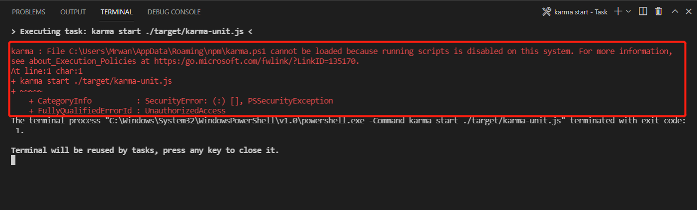

# Running scripts is disabled on this system

## 问题描述

```
xxx cannot be loaded because running scripts is disabled on this system.
```


## 解决方法

使用以下命令：

```shell
$ Set-ExecutionPolicy RemoteSigned
```

## 延伸

PowerShell 的执行策略默认为 Restricted 状态. 为了运行 PowerShell 脚本，需要更改执行策略。

有4种主要不同的执行策略，可以根据需要来更改它：
 
Restricted: 不能运行 PowerShell 脚本。 这就是为什么在 PowerShell 运行脚本被禁用的原因。
AllSigned: 只能运行由可信发布者签名的 PowerShell 脚本。
RemoteSigned: 可以运行由可信发布者签名的脚本。
Unrestricted: 可以运行所有的 Windows PowerShell 脚本。

参考：[Resolved: Running Scripts Is Disabled on This System](https://www.partitionwizard.com/clone-disk/running-scripts-is-disabled-on-this-system.html)