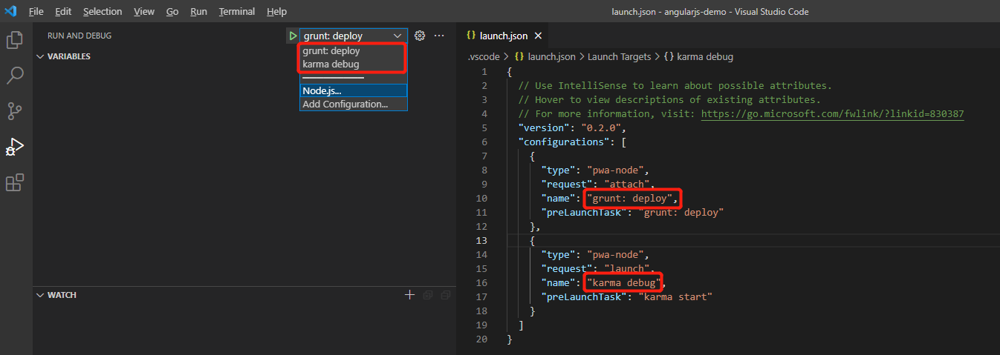

# VSCode 在 Run and Debug 栏中运行Grunt任务（task）

## 相关文件

### Gruntfile.js

该文件中可以定义用于处理代码的任务（task），例如 build、test、uglify等。

### tasks.json

该文件用于定义在VSCode中运行的任务（task），这些任务可以去执行shell命令或脚本，又或者去执行Gruntfile.js文件中的任务。
区别于Gruntfile.js文件中的任务，这里的任务只能是给VSCode使用的，也就是说并不是代码的一部分。

### launch.json

该文件中定义的配置（configurations）将直接暴露给 Run and Debug 栏中的配置下拉选，如下：



## 在 Gruntfile.js 中配置 tasks

```json
{
	"version": "2.0.0",
	"tasks": [                          // 可指定多个 task。
        {
            "type": "grunt",            // 任务类型为 Grunt。
            "task": "deploy",           // 指定在 Grunt 任务列表中的 deploy 任务。
            "args": [                   // 可为任务 deploy 任务指定参数。
                "--webappDir=D:/Program Files/Parasoft/DTP/tomcat/webapps/grs"
            ],
            "label": "grunt: deploy"    // 暴露该 VSCode 任务，并取名为 grunt: deploy。稍后可以在 launch.json 使用该名称来调用该任务。
        },
        {
            "type": "shell",            // 任务类型为 shell。
            "command": "karma start ./target/karma-unit.js",    // 指定 shell 命令行。
            "label": "karma start",
            "dependsOn": "grunt: build" // 依赖其他任务，被依赖的任务需要执行完毕后才开始执行该任务。
        },
        {
            "type": "grunt",
            "task": "build",
            "group": "build",
            "label": "grunt: build",
        }
  ]
}
```

参考：https://code.visualstudio.com/Docs/editor/tasks

## 在 launch.json 中配置 configuration

```json
{
  // Use IntelliSense to learn about possible attributes.
  // Hover to view descriptions of existing attributes.
  // For more information, visit: https://go.microsoft.com/fwlink/?linkid=830387
  "version": "0.2.0",
  "configurations": [
    {
      "type": "pwa-node",               // 指定为 node 类型
      "request": "attach",              // 运行完后不需要一直挂起
      "name": "grunt: deploy",          // 将该配置命名为 grunt: deploy，可以在 Run and Debug 栏中的下拉选查看。
      "preLaunchTask": "grunt: deploy"  // 前置任务为 grunt: deploy，该任务存在与 tasks.json 中，因为当前配置没有其他特殊操作，所以该配置则被认为是专门执行grunt: deploy 任务的。
    },
    {
      "type": "pwa-node",
      "request": "launch",              // 运行完后需要挂起。
      "name": "karma debug",            // 将该配置命名为 karma debug，可以在 Run and Debug 栏中的下拉选查看。
      "preLaunchTask": "karma start"    // 前置任务为 karma start，该任务存在与 tasks.json 中，因为当前配置没有其他特殊操作，所以该配置则被认为是专门执行 karma start 任务的。
    }
  ]
}
```